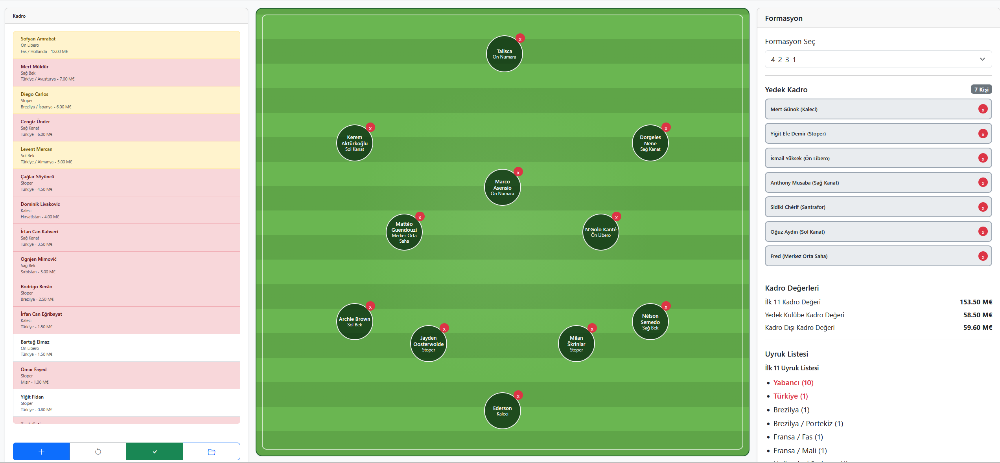
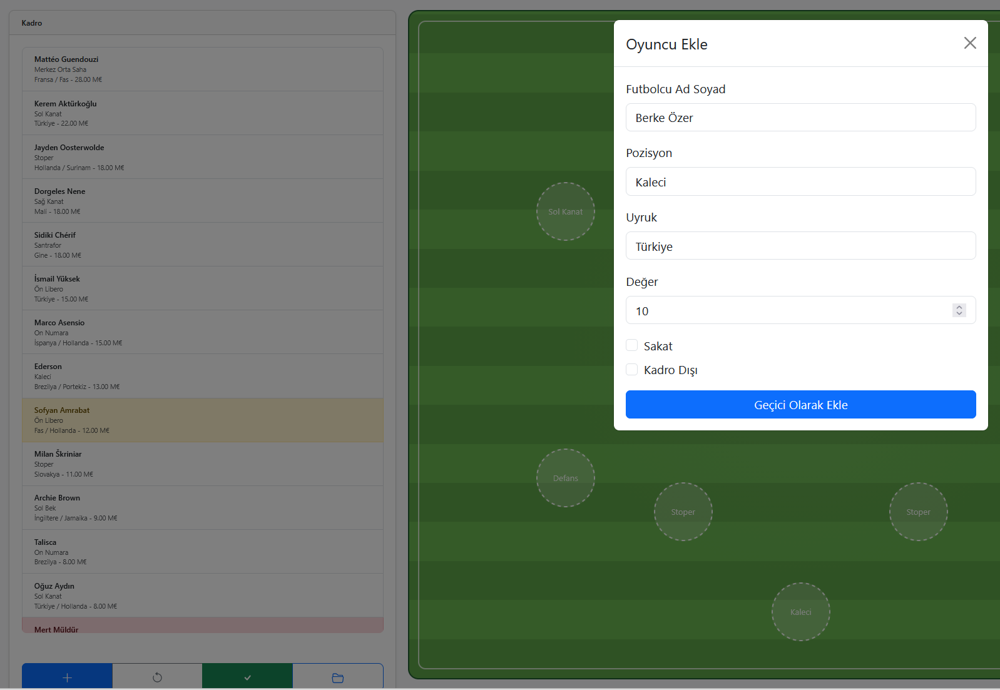
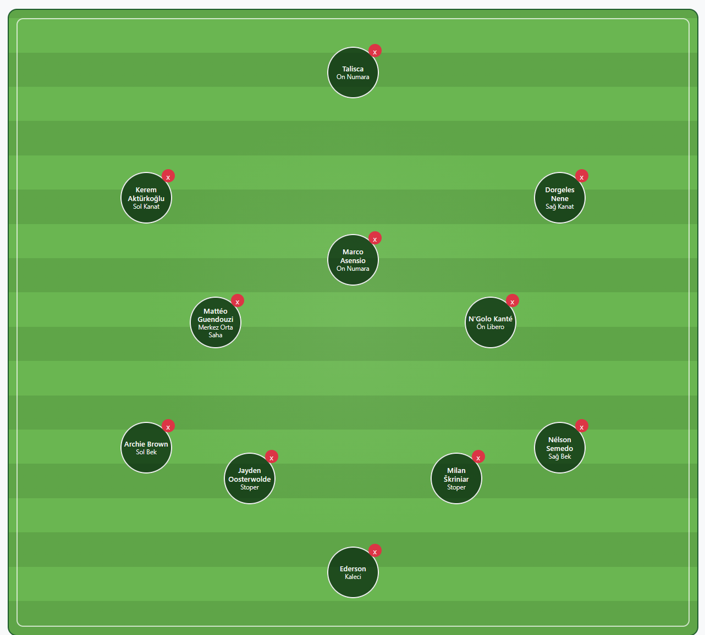
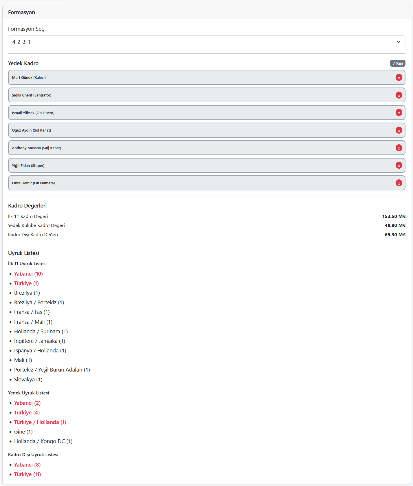

# ⚽ İlk 11 Oluşturucu

<p align="center">
  
</p>

<p align="center">
  Formasyona göre ilk 11 ve yedek kulübesi oluşturma uygulaması
</p>

<p align="center">
  🎥 <a href="https://www.youtube.com/watch?v=VIDEO_ID">Tanıtım Videosunu İzle</a>
</p>

---

## Özellikler

✅ Oyuncu ekleme, düzenleme ve silme

✅ Bir oyuncuya istediğin pozisyona sürükleyebilme

✅ Formasyon seçimi (4-4-2, 4-2-3-1, 3-5-2 vb.)

✅ Oyuncuları sahaya, yedek klübesine sürükleyebilme, oyuncu yerlerini değiştirebilme

✅ Formasyondaki yerleri değiştirebilme

✅ Sürükle-bırak ile sahaya oyuncu yerleştirme

✅ Yedek kulübesi oluşturma

✅ Yerli / yabancı oyuncu sayısı hesaplama

✅ Oyuncu piyasa değeri takibi (ilk11, yedekler, kadro dışı olanlar ayrı-ayrı)

✅ Sakat ve kadro dışı oyuncu yönetimi

✅ JSON içe/dışa aktarma

✅ LocalStorage ile otomatik kayıt

---

## Ekran Görüntüleri

### Oyuncu Yönetimi



### Formasyon ve İlk 11



### Yedek Kulübesi



---

## Kullanım

1. Oyuncuları ekleyin.
2. Formasyon seçin.
3. Oyuncuları sahaya sürükleyin.
4. Yedek kulübesini oluşturun.
5. Kadroyu JSON olarak kaydedin.

---

## Kurulum

```bash
git clone https://github.com/omerosmanoglu/football-lineup-builder.git
```

Ardından `index.html` dosyasını tarayıcıda açın.

---

## Demo Video

🎥 https://www.youtube.com/watch?v=VIDEO_ID

---

## Lisans

MIT License